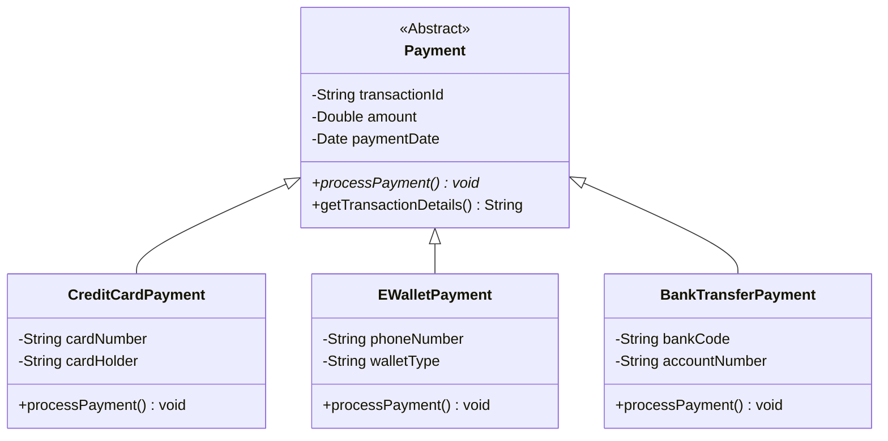

# Báo cáo: Thiết kế Kiến trúc Thanh toán (Trade-off Analysis)
**Dự án:** Hệ thống RikkeiLearn

## Phần 1: Đề xuất 2 giải pháp thiết kế

### Giải pháp 1: Sử dụng Kế thừa (Inheritance) với Abstract Class
*   **Mô tả:** Tạo một lớp trừu tượng (Abstract Class) mang tên `Payment` chứa các thuộc tính chung (mã giao dịch, số tiền, ngày thanh toán) và một phương thức trừu tượng `processPayment()`. 
*   **Cách hoạt động:** Các lớp con như `CreditCardPayment`, `EWalletPayment`, `BankTransferPayment` sẽ kế thừa (Inherit) từ lớp `Payment`. Thuộc tính được tái sử dụng hoàn toàn, nhưng mỗi lớp con bắt buộc phải ghi đè (Override) phương thức `processPayment()` để chứa logic gọi API riêng biệt (VNPay, MoMo, v.v.).

### Giải pháp 2: Sử dụng Thực thi (Realization) với Interface và Composition (Strategy Pattern)
*   **Mô tả:** Tách biệt hoàn toàn Dữ liệu (Data) và Hành vi (Behavior). Các thuộc tính chung được gom vào một data class/schema riêng biệt (ví dụ: `PaymentTransaction`). Hành vi thanh toán được định nghĩa qua một Interface `IPayment` có hàm `processPayment(transaction: PaymentTransaction)`.
*   **Cách hoạt động:** Trong các kiến trúc backend hiện đại (đặc biệt khi kết hợp với các ORM model hay các framework định nghĩa data schema chặt chẽ), giải pháp này cho phép truyền đối tượng dữ liệu vào lớp xử lý logic. `CreditCardProcessor`, `EWalletProcessor` chỉ cần *implement* `IPayment` mà không cần lưu trữ trạng thái.

## Phần 2: Bảng so sánh Trade-off

| Tiêu chí | Giải pháp 1: Abstract Class (Kế thừa) | Giải pháp 2: Interface + Composition (Strategy Pattern) |
| :--- | :--- | :--- |
| **Tái sử dụng mã (DRY)** | **Rất tốt.** Các thuộc tính được khai báo đúng một lần ở lớp cha. Các lớp con tự động có các thuộc tính này. | **Tốt.** Gom được dữ liệu chung vào một cấu trúc, nhưng phải truyền qua lại như một tham số. |
| **Tính mở rộng (OCP)** | **Khá.** Thêm mới phương thức thanh toán dễ dàng bằng cách tạo class con mới. Tuy nhiên, nó bị ràng buộc chặt (Tight Coupling) giữa dữ liệu và logic nghiệp vụ. | **Rất xuất sắc.** Tách biệt hoàn toàn logic gọi API và cấu trúc dữ liệu lưu trữ. Thêm mới rất dễ mà không đụng chạm đến data model hiện tại. |
| **Độ phức tạp bảo trì** | **Thấp.** Mô hình OOP cơ bản, trực quan, dễ hiểu đối với cấu trúc hệ thống quy mô vừa. | **Cao hơn một chút.** Cần am hiểu về Design Pattern, phân tách rạch ròi giữa Data Layer và Service Layer. |

## Phần 3: Triển khai thiết kế (Class Diagram)

**Giải pháp được chọn: Giải pháp 1 (Abstract Class)**
*Lý do:* Giải pháp này đáp ứng trực tiếp và hoàn hảo nhất yêu cầu của bài toán: "không bị lặp lại các thuộc tính chung" trong thiết kế hướng đối tượng cơ bản, đồng thời đảm bảo mỗi phương thức thanh toán có không gian riêng để gọi API đối tác qua tính đa hình (Polymorphism).

### Class Diagram (Mermaid)

